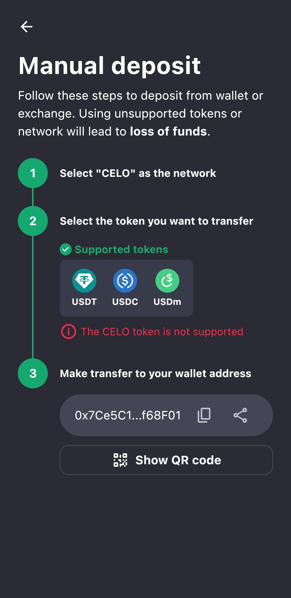
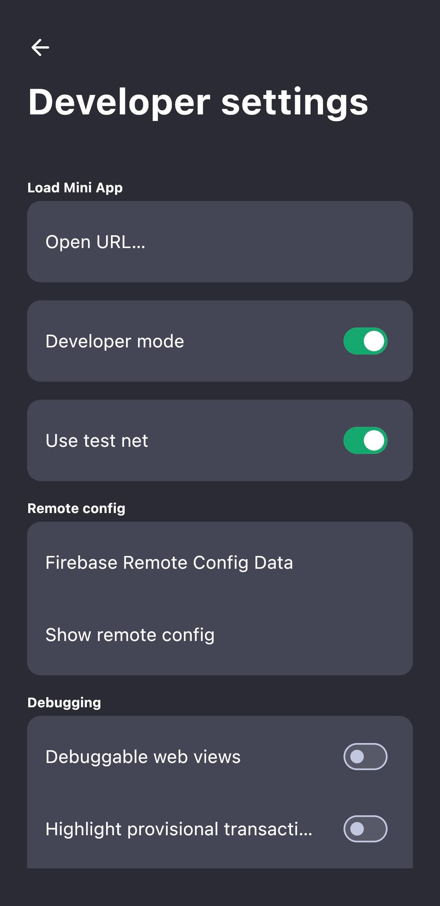
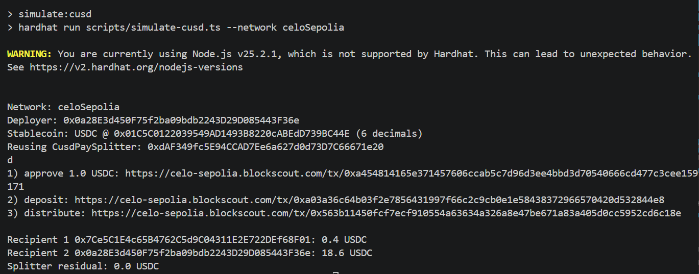
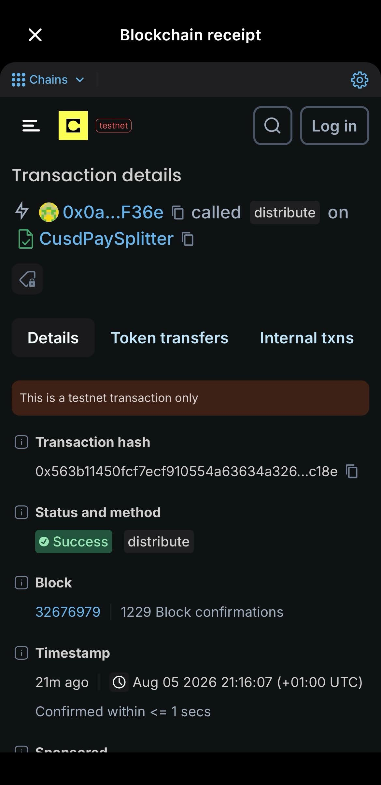

# VAL-006 Independent Technical Review

**Review date:** 2026-08-05  
**Scope:** `celo-minipay/`  
**Reviewer position:** Independent reproduction and source review  
**Overall result:** **Pass with limitations**

## 1. Executive conclusion

The core VAL-006 payment flow passed in this review:

1. The stablecoin splitter compiled and all seven local tests passed.
2. A fresh `CusdPaySplitter` was deployed and verified on Celo Sepolia.
3. The test wallet approved and deposited 1 USDC.
4. The contract sent 0.4 USDC to a real MiniPay testnet wallet and returned 0.6 USDC to the test wallet.
5. No USDC remained in the contract.
6. MiniPay showed the incoming `+$0.40`, and its blockchain receipt marked the `distribute` call as successful on testnet.

The test showed contract execution on Celo Sepolia and delivery to a MiniPay wallet address. It did not show a working MiniPay Mini App, MiniPay signing the contract calls, or phone-number lookup. The repository only documents those features and provides sample code (`celo-minipay/MINIPAY.md:7-56`; `celo-minipay/package.json:1-18`).

The earliest VAL-006 README in Git history, commit `f690496`, calls MiniPay SDK integration and phone-number transfers an **Extension** (`celo-minipay/README.md` at that commit, lines 19-20). No RFP or acceptance document in the repository makes that extension required. The current README links only to the conceptual MiniPay guide (`celo-minipay/README.md:119-122`).

**Result:** VAL-006 passes for the core stablecoin splitter and successful delivery to MiniPay. The optional MiniPay SDK and phone-number transfer extension is not complete.

This is a technical validation result, not approval for production use. Section 8 lists the remaining security and scaling risks.

## 2. Evidence classification

### 2.1 Observed in the live test

- Celo Sepolia chain ID `11142220` and RPC configuration worked as configured in `celo-minipay/hardhat.config.ts:13-24`.
- USDC at `0x01C5C0122039549AD1493B8220cABEdD739BC44E` behaved as a 6-decimal ERC-20, matching `celo-minipay/.env.example:11-14` and the default in `celo-minipay/scripts/simulate-cusd.ts:14-16`.
- `npm ci` installed the locked dependency tree.
- `npm run compile` compiled three Solidity files successfully.
- `npm test` passed all seven cases defined in `celo-minipay/test/CusdPaySplitter.test.ts:25-94`.
- Fresh deployment address: [0xdAF349fc5E94CCAD7Ee6a627d0d73D7C66671e20](https://celo-sepolia.blockscout.com/address/0xdAF349fc5E94CCAD7Ee6a627d0d73D7C66671e20#code).
- Blockscout confirmed that the fresh deployment is fully verified and identifies it as `CusdPaySplitter`.
- The live approve, deposit, and distribute sequence completed successfully.
- MiniPay developer mode and **Use test net** were enabled in the normal iOS MiniPay application.
- MiniPay accepted USDC deposits on the Celo network and displayed the public testnet wallet address `0x7Ce5C1E4c65B4762C5d9C04311E2E722DEf68F01`.
- The MiniPay Activity screen showed `Received +$0.40`.
- The MiniPay blockchain receipt identified the transaction as testnet, method `distribute`, and status `Success`.

### 2.2 Found in source code but not run end to end

- The contract fixes the token address at deployment (`celo-minipay/contracts/CusdPaySplitter.sol:20-35`).
- Only the owner can call `distribute` (`celo-minipay/contracts/CusdPaySplitter.sol:37-40,51-59`).
- Deposits require prior ERC-20 approval (`celo-minipay/contracts/CusdPaySplitter.sol:42-49`).
- The script calculates a fixed 40/60 split between exactly two recipients (`celo-minipay/scripts/simulate-cusd.ts:80-86`).
- The repository describes MiniPay provider detection and SocialConnect/ODIS phone lookup, but does not implement or test them (`celo-minipay/MINIPAY.md:7-23,42-56`).

### 2.3 Not tested

- The older deployment and transaction set recorded in `celo-minipay/README.md:28-40` was not needed for this reproduction because a separate fresh deployment was made.
- The claimed MiniPay outbound fee-currency gas failure in `celo-minipay/REPORT.md:64-83` was not reproduced. Git history shows that claim entered in commit `858fce5`, but the reviewed commit contains no supporting screenshot or machine-readable log.
- Phone-number lookup, SocialConnect/ODIS resolution, invitation/escrow fallback, and phone-number-based payment were not executed (`celo-minipay/MINIPAY.md:42-56`).
- A Mini App was not loaded inside MiniPay because the repository contains no runnable Mini App frontend.
- Mainnet MiniPay behavior was not tested.

## 3. Architecture and execution flow

```text
Throwaway test EOA
  │
  ├─ approve(splitter, 1 USDC) ──► USDC contract
  │
  ├─ deposit(1 USDC) ────────────► CusdPaySplitter
  │                                  │
  │                                  └─ transferFrom(test EOA, splitter, 1 USDC)
  │
  └─ distribute([MiniPay, EOA], [0.4, 0.6])
                                     │
                                     ├─ 0.4 USDC ──► MiniPay testnet wallet
                                     └─ 0.6 USDC ──► test EOA
```

The implementation has four layers:

| Layer | Role | Source |
|---|---|---|
| Hardhat configuration | Selects Celo Sepolia, RPC, signer, compiler, and explorer | `celo-minipay/hardhat.config.ts:7-52` |
| Stablecoin contract | Pulls approved tokens and lets the owner distribute them | `celo-minipay/contracts/CusdPaySplitter.sol:20-64` |
| Automation scripts | Deploy, verify instructions, approve, deposit, distribute, and read balances | `celo-minipay/scripts/deploy-cusd.ts:14-40`; `celo-minipay/scripts/simulate-cusd.ts:34-101` |
| MiniPay recipient | Receives the ERC-20 transfer like any other EVM address | No MiniPay runtime code exists in the repository; the integration is described in `celo-minipay/MINIPAY.md:7-56` |

VAL-006 is independent of Cardano and VAL-003. It uses Celo Sepolia, an EVM network, and does not call any Cardano service.

## 4. Repository inventory

The current README accurately lists the main files at `celo-minipay/README.md:15-26`:

- `contracts/CusdPaySplitter.sol`: stablecoin splitter.
- `contracts/MockERC20.sol`: local test token only; its warning is clear (`celo-minipay/contracts/MockERC20.sol:4-7`).
- `contracts/PaySplitter.sol`: original native-CELO version.
- `scripts/deploy-cusd.ts`: stablecoin deployment.
- `scripts/simulate-cusd.ts`: live approve/deposit/distribute flow.
- `test/CusdPaySplitter.test.ts`: seven local unit tests.
- `.env.example`: public configuration template; `.env` is ignored (`celo-minipay/.gitignore:1-7`).
- `MINIPAY.md`: conceptual MiniPay integration guide.
- `REPORT.md`: project author's friction report.

There is no frontend directory, Mini App manifest, React application, WalletConnect UI, or compiled SocialConnect client. The dependency list is only Hardhat/tooling (`celo-minipay/package.json:11-18`).

## 5. Independent reproduction results

### 5.1 Environment

| Item | Observed value |
|---|---|
| Host | WSL2 with Docker Desktop available, although Docker was not required for VAL-006 |
| Node.js | `v25.2.1` |
| npm | `11.6.2` |
| Network | Celo Sepolia, chain ID `11142220` |
| RPC | `https://forno.celo-sepolia.celo-testnet.org` |
| Stablecoin | USDC, 6 decimals |
| Test EOA | `0x0a28E3d450F75f2ba09bdb2243D29D085443F36e` |
| MiniPay recipient | `0x7Ce5C1E4c65B4762C5d9C04311E2E722DEf68F01` |

The review used a new throwaway testnet key. It remained in the ignored local `.env` file and was never printed in the report. This follows the warning in `celo-minipay/.env.example:1-5`.

### 5.2 Dependency installation

`npm ci` installed 583 packages from the lockfile and reported 43 known vulnerabilities: 18 low, 9 moderate, and 16 high. `npm audit fix` was not run because it would change the locked dependencies and could introduce breaking changes.

### 5.3 Compile and tests

Compilation succeeded for three Solidity files. All seven tests passed. The tests cover:

- rejection of a zero token address (`celo-minipay/test/CusdPaySplitter.test.ts:25-28`);
- approved deposit and event emission (`celo-minipay/test/CusdPaySplitter.test.ts:30-40`);
- failure without approval (`celo-minipay/test/CusdPaySplitter.test.ts:42-45`);
- 40/60 distribution and zero residual (`celo-minipay/test/CusdPaySplitter.test.ts:47-64`);
- owner-only distribution (`celo-minipay/test/CusdPaySplitter.test.ts:66-74`);
- mismatched array rejection (`celo-minipay/test/CusdPaySplitter.test.ts:76-84`); and
- insufficient contract balance rejection (`celo-minipay/test/CusdPaySplitter.test.ts:86-94`).

Hardhat warned that Node.js `v25.2.1` is unsupported. Compilation and tests still passed, but the warning shows that the README's `Node.js 18+` requirement is too broad (`celo-minipay/README.md:43-47`).

### 5.4 Funding and deployment

The throwaway EOA received 0.3 test CELO for gas and 20 test USDC. The stablecoin balance was verified as 20 USDC on chain before deployment.

The fresh contract was deployed at:

[0xdAF349fc5E94CCAD7Ee6a627d0d73D7C66671e20](https://celo-sepolia.blockscout.com/address/0xdAF349fc5E94CCAD7Ee6a627d0d73D7C66671e20#code)

The deployment script passed the official Celo Sepolia USDC address to the constructor (`celo-minipay/scripts/deploy-cusd.ts:9-27`).

### 5.5 First live simulation

An initial 1 USDC simulation to two generated recipients completed. Later direct balance reads confirmed:

- Recipient 1: 0.4 USDC.
- Recipient 2: 0.6 USDC.
- Splitter residual: 0 USDC.

The script first showed Recipient 1 as 0.0 USDC, but a later read showed the correct 0.4 USDC balance. A stale public RPC read may explain the difference, but the cause was not confirmed. The script waits for the transaction receipt (`celo-minipay/scripts/simulate-cusd.ts:71-85`) and then immediately reads three balances (`celo-minipay/scripts/simulate-cusd.ts:88-96`) without retrying or fixing the block number.

### 5.6 MiniPay delivery simulation

The second simulation used the actual MiniPay testnet address as Recipient 1 and returned Recipient 2's share to the throwaway EOA.

| Step | Transaction | Result |
|---|---|---|
| Approve 1 USDC | [0xa454814165e371457606ccab5c7d96d3ee4bbd3d70540666cd477c3cee159171](https://celo-sepolia.blockscout.com/tx/0xa454814165e371457606ccab5c7d96d3ee4bbd3d70540666cd477c3cee159171) | Completed |
| Deposit 1 USDC | [0xa03a36c64b03f2e7856431997f66c2c9cb0e1e58438372966570420d532844e8](https://celo-sepolia.blockscout.com/tx/0xa03a36c64b03f2e7856431997f66c2c9cb0e1e58438372966570420d532844e8) | Completed |
| Distribute 40/60 | [0x563b11450fcf7ecf910554a63634a326a8e47be671a83a405d0cc5952cd6c18e](https://celo-sepolia.blockscout.com/tx/0x563b11450fcf7ecf910554a63634a326a8e47be671a83a405d0cc5952cd6c18e) | Success; block `32676979` |

Final reported balances:

- MiniPay `0x7Ce5…8F01`: **0.4 USDC**.
- Test EOA `0x0a28…F36e`: **18.6 USDC total balance**.
- Splitter: **0 USDC**.

The output matches the script's fixed split calculation at `celo-minipay/scripts/simulate-cusd.ts:80-96`.

## 6. Screenshot review and privacy check

This report includes five screenshots that were checked for personal or secret information.

| Evidence | What it proves | Privacy result |
|---|---|---|
| MiniPay Manual deposit | USDC is shown as supported and the MiniPay EVM address is available | Safe; only a truncated public wallet address is visible |
| MiniPay Developer settings | Developer mode and **Use test net** are enabled | Safe; no personal data or remote-config contents are visible |
| Terminal simulation | Network, public addresses, three transaction links, 0.4 USDC receipt, and zero residual | Safe; only public blockchain identifiers are visible |
| MiniPay Activity | The app recorded `Received +$0.40` | Safe; no name, phone number, or account identifier is visible |
| MiniPay blockchain receipt | Testnet, `distribute`, transaction hash, success, block, confirmations, and timestamp | Safe; all displayed values are public blockchain data |

None of the screenshots shows a phone number, Apple ID, email, recovery phrase, private key, OTP, or passcode. Wallet addresses and transaction hashes are public, but they can still be linked to this test. They should only be published intentionally.

### 6.1 MiniPay deposit address and supported assets

{width=3.2in}

*Figure 1. MiniPay shows USDC as a supported Celo deposit asset and displays the test wallet address.*

### 6.2 MiniPay testnet configuration

{width=3.2in}

*Figure 2. The standard MiniPay iOS application has Developer mode and Use test net enabled.*

### 6.3 Independent live simulation

{width=6.5in}

*Figure 3. The live simulation sent 0.4 USDC to the MiniPay address, returned 0.6 USDC to the test EOA, and left no USDC in the splitter.*

### 6.4 MiniPay receipt

{width=3.2in}

*Figure 4. MiniPay recorded the incoming payment as Received +$0.40.*

{width=3.2in}

*Figure 5. The in-app blockchain receipt identifies the successful testnet distribute call and its transaction hash.*

## 7. Comparison with repository claims

| Repository claim | Independent result | Assessment |
|---|---|---|
| Celo Sepolia replaces the named Alfajores target (`celo-minipay/README.md:7-13`) | Celo Sepolia worked with chain ID `11142220` | Confirmed |
| Default stablecoin is Sepolia USDC (`celo-minipay/README.md:61-68`) | 20 faucet USDC was received and used successfully | Confirmed |
| Local flow is approve → deposit → distribute (`celo-minipay/README.md:78-85`) | Seven tests passed | Confirmed |
| Live script logs hashes and balances (`celo-minipay/README.md:108-117`) | Both live simulations completed | Confirmed |
| Payment can be delivered to MiniPay (`celo-minipay/README.md:3-5`) | A real MiniPay iOS testnet wallet received 0.4 USDC | Confirmed for receiving funds only |
| The README links to MiniPay SDK and phone-number transfer guidance (`celo-minipay/README.md:119-122`) | Prose and a small code example exist; there is no runnable Mini App or SocialConnect implementation | Documentation exists, but the optional extension is not implemented |
| There is no shipping consumer testnet build (`celo-minipay/MINIPAY.md:58-66`) | The normal iOS app exposes a hidden developer/testnet toggle, and current official MiniPay documentation describes this testnet mode | Repository documentation is outdated and misleading |
| Tap version about seven times (`celo-minipay/REPORT.md:64-68`) | The iOS test required roughly ten taps | Minor UI/version drift; instructions should say “tap repeatedly until enabled” |
| MiniPay testnet transfers fail (`celo-minipay/REPORT.md:64-83`) | Receiving worked; outbound sending from MiniPay was not tested | Unverified; receiving worked, but outbound sending was not tested |
| README evidence checklist requires MiniPay interface or Valora screenshot (`celo-minipay/README.md:124-131`) | MiniPay settings, activity, and receipt evidence were captured | Satisfied for receipt evidence |

## 8. Findings and risks

### F-01: Optional MiniPay integration is documentation only

**Severity:** Limitation. High only if the optional integration is represented as implemented.

The repository has no Mini App frontend and no SocialConnect/ODIS implementation. `MINIPAY.md` provides conceptual steps and a small `viem` example (`celo-minipay/MINIPAY.md:7-56`), but `package.json` contains only Hardhat development dependencies (`celo-minipay/package.json:11-18`).

**Impact:** The test proves that a MiniPay-controlled EVM address received funds. It does not prove MiniPay SDK use, signing through MiniPay, or phone-number payments. This does not change the core result because the earliest task description marked those features as an extension.

### F-02: Depositor funds are controlled only by the permanent owner

**Severity:** High for production use.

Anyone may deposit (`celo-minipay/contracts/CusdPaySplitter.sol:42-49`), but only the deployment owner can distribute (`celo-minipay/contracts/CusdPaySplitter.sol:21,37-40,51-59`). There is no depositor refund, withdrawal, ownership transfer, or recovery mechanism.

**Impact:** A wrong deposit or lost owner key can permanently trap funds. The design is custodial and should not be described as trustless.

### F-03: “Many recipients” is limited by an unbounded loop

**Severity:** Medium to high, depending on batch size.

`distribute` loops over every recipient and performs both `balanceOf` and `transfer` on every iteration (`celo-minipay/contracts/CusdPaySplitter.sol:51-58`). A large batch can exceed the block gas limit and revert completely.

**Impact:** The two-recipient test passed, but it does not show that the contract can handle large batches. Production use would need chunking, a Merkle distributor, or a claim-based design.

### F-04: Known dummy private key can be used on the live network

**Severity:** High if a user forgets `.env`.

When `PRIVATE_KEY` is missing, the Hardhat configuration falls back to the public, known key `0x...01` and still configures it for Celo Sepolia (`celo-minipay/hardhat.config.ts:7-11,18-24`).

**Impact:** The fallback is convenient for local compilation and tests but unsafe on a live network. Live-network tasks should stop with a clear error when no private key is set.

### F-05: Default random recipients destroy access to test funds

**Severity:** Medium.

If `RECIPIENTS` is absent or has fewer than two values, the script generates two new random addresses and discards their private keys (`celo-minipay/scripts/simulate-cusd.ts:25-32`). The README documents the random-address behavior (`celo-minipay/README.md:115-117`) but does not clearly say those funds will be unrecoverable.

**Impact:** A default run can waste faucet funds and create recipient addresses that do not prove MiniPay delivery.

### F-06: Immediate RPC balance output can be stale

**Severity:** Medium for evidence quality.

The first simulation printed an incorrect immediate Recipient 1 balance, then a later direct read returned the correct 0.4 USDC. The script reads balances immediately after the distribution receipt with no retry (`celo-minipay/scripts/simulate-cusd.ts:84-96`).

**Impact:** A successful transaction can still be followed by a misleading balance result. The script should retry the read, use a fixed block tag, or wait for another block.

### F-07: ERC-20 handling is narrow

**Severity:** Medium.

The contract calls raw `transferFrom` and `transfer` and requires a Boolean return (`celo-minipay/contracts/CusdPaySplitter.sol:4-10,42-58`). It does not use a compatibility wrapper such as `SafeERC20`. It also records the requested deposit amount rather than the actual balance increase (`celo-minipay/contracts/CusdPaySplitter.sol:44-48`).

**Impact:** It works with the tested USDC, but fee-on-transfer, rebasing, or non-standard tokens may fail or produce incorrect bookkeeping. The “token-agnostic” claim at `celo-minipay/contracts/CusdPaySplitter.sol:16-19` should be qualified.

### F-08: Test coverage does not match live USDC decimals or edge cases

**Severity:** Medium.

The mock always uses 18 decimals (`celo-minipay/contracts/MockERC20.sol:9-15`), while live USDC uses 6. The script handles live decimals dynamically (`celo-minipay/scripts/simulate-cusd.ts:39-60`), but that path is not unit-tested. There are also no tests for zero recipient addresses, empty batches, fee-on-transfer tokens, ownership loss, large recipient sets, or duplicate recipients.

### F-09: Toolchain and dependency reproducibility is weak

**Severity:** Medium.

The README says `Node.js 18+` (`celo-minipay/README.md:43-47`), but Node 25 produced an explicit unsupported-version warning from Hardhat. No `.nvmrc`, `.node-version`, Volta setting, or `engines` field pins a supported runtime (`celo-minipay/package.json:1-18`). npm also reported 43 dependency vulnerabilities during the clean install.

**Impact:** Results may differ across Node versions. The project should pin a supported LTS release and review dependency warnings before making upgrades that may break the project.

### F-10: MiniPay documentation is incomplete and partly stale

**Severity:** Medium.

The guide says there is no shipping consumer testnet build and points readers toward an in-app dApp tester or mainnet (`celo-minipay/MINIPAY.md:58-66`). The normal standalone iOS app used in this review exposed Developer mode and **Use test net**. The same guide describes MiniPay mainly as Opera Mini's built-in wallet (`celo-minipay/MINIPAY.md:3-5`), although a standalone iOS app was used successfully.

**Impact:** A reviewer could wrongly conclude that direct Sepolia testing in the consumer app is impossible.

### F-11: Historical gas-bug evidence is not stored in the repository

**Severity:** Medium for auditability.

`REPORT.md` records precise gas values and an Android failure (`celo-minipay/REPORT.md:64-83`), introduced in commit `858fce5`, but the reviewed commit contains no screenshot or log file supporting it.

**Impact:** The claim may be genuine, but a new reviewer cannot inspect its original evidence. Until it is reproduced, the report should describe it as historical and specific to that device and version.

### F-12: The simulation only supports two recipients

**Severity:** Low to medium.

The contract accepts arrays, but the script takes only the first two supplied addresses and silently ignores any extra entries (`celo-minipay/scripts/simulate-cusd.ts:25-31`). It then hardcodes a 40/60 split (`celo-minipay/scripts/simulate-cusd.ts:80-85`).

**Impact:** The automated demo does not validate the README's broader “many recipients” description (`celo-minipay/README.md:3-5`).

## 9. Reproducibility assessment

### Local contract testing: Good

The lockfile, mock token, compile script, and seven tests make local testing straightforward from a clean checkout (`celo-minipay/package.json:3-17`; `celo-minipay/test/CusdPaySplitter.test.ts:4-94`).

### Live Celo Sepolia deployment: Moderate

It is reproducible, but depends on:

- an internet connection and working public RPC;
- a securely generated throwaway private key;
- Celo Sepolia CELO and USDC faucets;
- current token addresses;
- a Hardhat-supported Node version; and
- explorer availability.

The README documents most network and faucet requirements (`celo-minipay/README.md:43-76`) but does not pin Node or automate environment validation.

### MiniPay receipt: Moderate

It was reproducible on iOS after:

1. installing the official MiniPay application;
2. completing account and phone onboarding;
3. tapping the version repeatedly to reveal Developer settings;
4. enabling Developer mode and **Use test net**;
5. copying the testnet public wallet address; and
6. using that address as a contract recipient.

These exact steps are not documented clearly in this repository. The current instructions at `celo-minipay/MINIPAY.md:58-66` should be updated.

### Optional MiniPay/phone-number integration: Not reproducible from this repository

There is no runnable Mini App or phone-number resolution code. A clean checkout cannot reproduce those claims without building additional software beyond the repository's current scope.

## 10. Acceptance matrix

| Validation target | Result | Evidence |
|---|---|---|
| Stablecoin splitter compiles | Pass | Independent Hardhat compile |
| Contract logic tests | Pass | 7/7 tests |
| Deploy to current Celo testnet | Pass | Fresh Celo Sepolia contract |
| Explorer verification | Pass | Blockscout verified source |
| Stablecoin approve and deposit | Pass | Independent transaction links |
| 40/60 distribution | Pass | 0.4/0.6 USDC results |
| Zero residual | Pass | Script and later balance read |
| Actual MiniPay wallet receives payout | Pass | MiniPay Activity and blockchain receipt |
| MiniPay test interface evidence | Pass | Developer/testnet settings and receipt screenshots |
| MiniPay signs contract calls | Optional extension, not tested | Calls were signed by the throwaway Hardhat EOA |
| MiniPay Mini App runs from this repo | Optional extension, not implemented | No frontend implementation; the earliest task description labelled SDK integration as an extension |
| Phone-number transfer | Optional extension, not implemented | Documentation only; the extension is not implemented |
| Outbound send from MiniPay | Not required and not tested | Historical failure claim not repeated |
| Production-ready multi-recipient distribution | Outside validation scope | Custodial owner and unbounded loop remain production limitations |

## 11. Recommended corrections

1. Describe the confirmed result as “delivery to a MiniPay wallet address” and clearly label the Mini App and phone-number work as an optional future extension.
2. Update `MINIPAY.md` with the standalone iOS/Android Developer settings and testnet flow observed here.
3. Label the fee-currency gas bug as historical, device/version-specific evidence and store its original screenshot/log.
4. Add a minimal Mini App that connects through `window.ethereum`, confirms `isMiniPay`, and calls or observes the splitter.
5. Implement the SocialConnect/ODIS phone-number flow or clearly label it as a design proposal rather than completed functionality.
6. Make live deployment fail when `PRIVATE_KEY` is missing; do not use a known fallback key on Celo Sepolia.
7. Replace random default recipients with an explicit requirement or a clear destructive-test warning.
8. Add post-receipt balance retries and report the receipt block.
9. Pin a supported Node LTS version and review the 43 dependency findings.
10. For production, redesign payout authorization, refunds, ownership recovery, and large-batch distribution.
11. Use `SafeERC20` and measure actual received token amounts if tokens beyond the tested USDC are supported.
12. Add tests using a 6-decimal token and cover large batches and unsafe recipient inputs.

## 12. Final verdict

**Pass with limitations.**

A fresh verified contract sent 0.4 test USDC to an actual MiniPay iOS testnet wallet. MiniPay showed the payment in its Activity screen and displayed a successful testnet blockchain receipt.

This repository is a Hardhat contract project, not a MiniPay application. It proves the on-chain split and that a MiniPay address can receive the payment. It does not implement the optional MiniPay SDK or phone-number transfer flow, and outbound sending from MiniPay was not tested. No acceptance document in the repository makes those extensions required, so these gaps do not change the core pass result.

## 13. External references

- [Celo network information](https://docs.celo.org/build-on-celo/network-overview)
- [Celo official token contracts](https://docs.celo.org/tooling/contracts/token-contracts)
- [MiniPay: test a Mini App](https://docs.minipay.xyz/getting-started/test-in-minipay.html)
- [MiniPay supported stablecoins and product overview](https://docs.minipay.xyz/getting-started/why-minipay.html)
- [Independent verified splitter](https://celo-sepolia.blockscout.com/address/0xdAF349fc5E94CCAD7Ee6a627d0d73D7C66671e20#code)
- [Independent successful distribution](https://celo-sepolia.blockscout.com/tx/0x563b11450fcf7ecf910554a63634a326a8e47be671a83a405d0cc5952cd6c18e)
