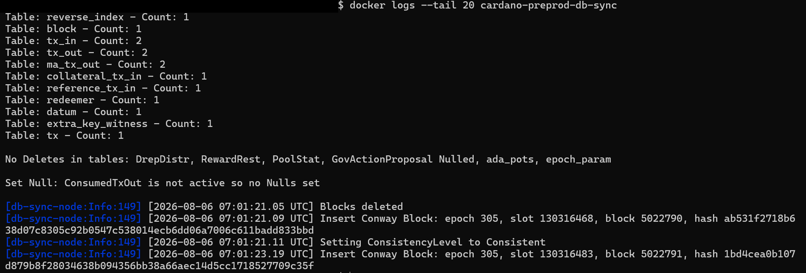
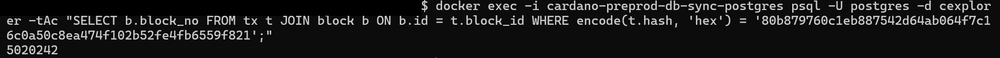
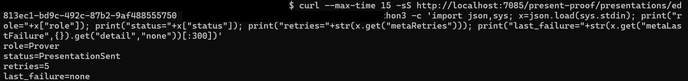
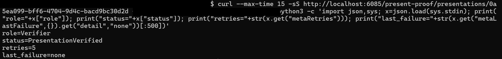

# VAL-003 Independent Technical Review

**Review date:** 2026-08-06  
**Scope:** `identus-setup/` and `cardano-preprod/`  
**Review status:** **Final**  
**Reviewer position:** Independent source review and live clean-environment reproduction

## 1. Executive conclusion

**Functional verdict: Pass.**

The core VAL-003 claim was reproduced from a fresh local setup:

1. A Cardano-backed issuer created and published a new `did:prism` on Cardano preprod.
2. Cardano Wallet confirmed the publication transaction, and the local DB Sync database placed it at block `5,020,242`.
3. A schema was registered and a JWT credential was issued over DIDComm.
4. The holder received the credential and later sent it to a separate verifier as a presentation.
5. The verifier resolved the issuer DID from its own PRISM-node database.
6. The verifier returned `PresentationVerified` with no recorded failure.

**Clean-environment reproducibility verdict: Weak as documented.** The flow worked only after missing environment variables were supplied, Docker Desktop networking was changed, an issuer DID with an `assertionMethod` key was created, and both Cardano indexing stages were allowed to run for many hours. The current README does not provide a reliable one-command or quick-start setup.

**Production-readiness verdict: Not established.** This was a local technical test. The fixed application passwords, HTTP-only services, development Vault setup, and unpinned Cardano node image were not validated for production use.

## 2. Scope and evidence standard

The review covered all tracked operational source and configuration files under `identus-setup/`, the shared Cardano stack under `cardano-preprod/`, relevant Git history, and a live reproduction on Docker Desktop with WSL2.

README claims were confirmed only when they matched the source code or a result observed during this reproduction, such as an API response, database query, command output, or screenshot.

The report contains no seeds, mnemonics, wallet passphrases, database passwords, Vault tokens, administrator tokens, or private keys. The screenshots were redacted only to hide local paths and API keys. The validation results were not changed.

## 3. Architecture and execution flow

```text
Cardano preprod network
        -> Cardano node
        -> Cardano DB Sync and its PostgreSQL database
        -> Issuer and verifier PRISM nodes

Issuer Cloud Agent
        -> publishes issuer DID through PRISM node and Cardano Wallet
        -> sends JWT credential to holder over DIDComm

Holder Cloud Agent
        -> stores wallet, connection, and credential state in PostgreSQL
        -> stores keys and secrets through Vault
        -> sends a JWT presentation to verifier over DIDComm

Verifier Cloud Agent
        -> resolves issuer DID through its PRISM node
        -> verifies the received JWT presentation
```

Each Identus role has four services:

| Service | Purpose | Confirmed configuration |
|---|---|---|
| Cloud Agent | REST API, DID management, DIDComm, credentials, and presentations | Defined in all three role Compose files |
| PRISM node | Publishes or resolves PRISM DID operations | Issuer and verifier use Cardano; holder uses `in-memory` |
| PostgreSQL | Stores Cloud Agent and PRISM-node state | Initializes `pollux`, `connect`, `agent`, and `node_db` databases |
| Vault | Stores wallet secrets and private key material | Uses Raft storage and KV v2 |

The holder's `in-memory` setting describes its local PRISM ledger mode. It does not mean the credential is kept only in temporary RAM. PostgreSQL stores credential and protocol records, while Vault handles protected key material.

## 4. Repository assets reviewed

| Asset | Purpose | Source evidence |
|---|---|---|
| `cardano-preprod/docker-compose.yml` | Cardano node, Wallet, DB Sync, and DB Sync PostgreSQL | `cardano-preprod/docker-compose.yml:16-88` |
| `cardano-preprod/config/byron-genesis.json` | Cardano Wallet testnet configuration | `cardano-preprod/docker-compose.yml:33-47` |
| `identus-setup/issuer/docker-compose.yml` | Cardano-backed issuer stack | `identus-setup/issuer/docker-compose.yml:1-130` |
| `identus-setup/holder/docker-compose.yml` | In-memory holder PRISM stack | `identus-setup/holder/docker-compose.yml:1-115` |
| `identus-setup/verifier/docker-compose.yml` | Cardano-backed verifier stack | `identus-setup/verifier/docker-compose.yml:1-129` |
| Role `.env.example` files | Role configuration templates | `identus-setup/{issuer,holder,verifier}/.env.example` |
| `generate-seed.js` and `generate-seed.sh` | Wallet seed generation options | `identus-setup/scripts/generate-seed.js:1-36`; `generate-seed.sh:1-9` |
| `postgres-init-multiple-databases.sh` | Database and application-role initialization | `identus-setup/scripts/postgres-init-multiple-databases.sh:5-45` |
| `vault-init.sh` | Vault initialization, unseal, token, and KV v2 setup | `identus-setup/scripts/vault-init.sh:1-63` |
| `ussd-endpoint.ts` | Small USSD response placeholder unrelated to the core proof flow | `identus-setup/scripts/ussd-endpoint.ts:1-17` |
| `identus-setup/README.md` | Setup instructions, execution examples, and historical claims | `identus-setup/README.md:1-415` |
| Root `README.md` | Monorepo index that identifies `identus-setup/` as VAL-003 | `README.md:7-20` |
| `CONTRIBUTING.md` | Repository structure and quality expectations that include VAL-003 | `CONTRIBUTING.md:59-74` |

## 5. Independent reproduction results

| Validation step | Observed result | Assessment |
|---|---|---|
| Identus Compose parsing | Issuer, holder, and verifier files passed no-interpolation configuration checks | Pass |
| Cardano node and Wallet | Wallet network endpoint reached `status=ready` in node mode | Pass |
| Holder, issuer, and verifier health | Each Cloud Agent returned version `2.2.0` with HTTP 200 | Pass |
| API-key registration | Holder, issuer, and verifier registrations returned HTTP 201 | Pass |
| Holder DID | Long-form `did:prism` creation returned HTTP 201 | Pass |
| Issuer DID | Replacement DID with authentication and assertion-method keys returned HTTP 201 | Pass |
| DID publication request | Publication returned HTTP 202 | Pass |
| Cardano Wallet confirmation | Transaction became outgoing `in_ledger` with metadata label `21325` | Pass |
| Independent DB Sync confirmation | Transaction was found at Cardano block `5,020,242` | Pass |
| Schema registration | Version `1.0.1` schema returned HTTP 201 | Pass |
| Issuer-to-holder DIDComm | Records reached `ConnectionResponseSent` and `ConnectionResponseReceived` | Pass after networking override |
| Credential issuance | Issuer reached `CredentialSent`; holder reached `CredentialReceived` | Pass |
| Verifier-to-holder DIDComm | Records reached `ConnectionResponseSent` and `ConnectionResponseReceived` | Pass after networking override |
| Verifier DID resolution | Fresh issuer DID suffix appeared in verifier `node_db.did_data` | Pass |
| Holder presentation | Holder record reached `PresentationSent` with no failure | Pass |
| Verifier result | Verifier record reached `PresentationVerified` with no failure | Pass |

### Public identifiers from this reproduction

| Item | Identifier |
|---|---|
| Issuer DID | `did:prism:3f4aa98cbc44c7439b207d5018b752ef2be371cc24a7a4438b9b73b4fbb85f14` |
| Publication transaction | `80b879760c1eb887542d64ab064f7c16c0a50c8ea474f102b52fe4fb6559f821` |
| Publication block | `5,020,242` |
| Schema GUID | `90802def-98c2-3a23-afe4-d0621ec47e6f` |
| Issuer credential record | `bc8dd08e-a481-4433-9eb9-bee7d89d0e8c` |
| Holder credential record | `9a236935-f52e-43e1-b78e-8b8ae543ba9f` |
| Presentation thread | `512a261d-7b5a-4231-87c8-4b4b778a0d78` |
| Holder presentation record | `ed813ec1-bd9c-492c-87b2-9af488555750` |
| Verifier presentation record | `0a5ea099-bff6-4704-9d4c-bacd9bc30d2d` |

## 6. Preserved execution evidence

Cardano DB Sync reached epoch 305 and reported `Consistent` near the Cardano node tip.

{width=6.3in}

*Figure 1: Cardano DB Sync reached epoch 305 and reported a consistent state.*

A query of the local DB Sync database placed the publication transaction at block `5,020,242`.

{width=6.3in}

*Figure 2: The fresh issuer DID publication transaction was found at Cardano block 5,020,242.*

The fresh issuer DID later appeared in the verifier's own database. This showed that its separate PRISM node had processed the publication and could resolve the DID without using the issuer's local database.

The holder then generated and sent the requested JWT presentation.

{width=6.3in}

*Figure 3: The holder record reached PresentationSent with no failure.*

The verifier then reported `PresentationVerified`.

{width=6.3in}

*Figure 4: The verifier record reached PresentationVerified with no failure.*

## 7. Sync behavior observed during reproduction

The reproduction involved three separate sync steps:

1. The Cardano node downloaded and followed Cardano preprod. Mithril bootstrap made the node and Cardano Wallet usable much earlier than a full genesis replay would.
2. Cardano DB Sync imported and indexed historical blocks into its PostgreSQL database. It required many active hours across multiple sessions before reaching epoch 305 and reporting `Consistent`.
3. The verifier PRISM node then scanned the Cardano DB Sync database and built its own PRISM state in `node_db`. Logs showed it reading individual Cardano blocks. The verifier DID query remained empty until this second scan reached the publication block.

During one stable interval, the PRISM scan processed about 113 to 116 Cardano blocks per second. This explains why a ready Cardano Wallet and a consistent DB Sync database do not mean that a new verifier can resolve DIDs immediately.

## 8. Original failure evidence and resolution history

### Historical JVM initialization problem

The README says that PRISM node `2.6.0` accepts `testnet` or `mainnet` and that using `NODE_CARDANO_NETWORK=preprod` causes a `NoSuchElementException` during startup at `identus-setup/README.md:366-368`. This fits a Scala/JVM application failing to map an unsupported enum value.

The current issuer and verifier Compose files use `NODE_CARDANO_NETWORK: testnet` at `identus-setup/issuer/docker-compose.yml:48-58` and `identus-setup/verifier/docker-compose.yml:44-58`. Both PRISM nodes started in this reproduction. The old failure was not recreated, so the exact stack trace is supported only by the repository's historical account.

### False in-memory publication behavior

The README says that omitting `NODE_LEDGER=cardano` can produce an apparent `PUBLISHED` result without a Cardano transaction at `identus-setup/README.md:361-364`. Current issuer and verifier files set `NODE_LEDGER: cardano`; the holder intentionally uses `in-memory`. A real Cardano publication transaction was observed, so this test did not use the false in-memory publication path.

### Selected Git history that explains the claimed resolution

| Commit | Repository change | Review interpretation |
|---|---|---|
| `d7d55fe` | Added the comprehensive VAL-003 README and engineering findings | Documents the proposed operational solution |
| `66e0eec` | Changed PRISM network configuration from `preprod` to `testnet`, added `NODE_LEDGER=cardano`, added required Cardano credentials, and introduced persistent Vault initialization | Strongest direct source evidence for how the false publication and JVM startup problems were corrected |
| `f9fafcf` | Added pinned Docker subnets, required passwords, passphrase variables, and restart-safe Vault token handling | Shows fixes introduced after review feedback |
| `8a5979e` | Declared VAL-003 complete and added the three role stacks through the final PR history | Source of the current end-to-end success claim; its tree matches `f9fafcf` |

These commits show how the original blocker was addressed. The live results in Sections 5 and 6 confirmed that the current setup works.

## 9. Findings and limitations

### F-01: Cardano environment template is missing

**Severity:** High for clean-environment reproducibility.

The README instructs users to copy `cardano-preprod/.env.example` at `identus-setup/README.md:79-83`, but that file does not exist. The Cardano Compose file requires `DBSYNC_POSTGRES_PASSWORD` at `cardano-preprod/docker-compose.yml:54-79`.

**Observed effect:** The first Cardano Compose configuration check failed because the variable was missing.

### F-02: Issuer and verifier templates omit a required DB Sync password

**Severity:** High for clean-environment reproducibility.

Both Cardano-backed PRISM nodes require `DBSYNC_POSTGRES_PASSWORD` at `identus-setup/issuer/docker-compose.yml:52-58` and `identus-setup/verifier/docker-compose.yml:52-58`. Neither related `.env.example` defines it.

**Observed effect:** The copied role templates were insufficient for normal interpolation. The shared DB Sync password had to be added manually before the issuer and verifier configurations could be validated.

### F-03: Default DIDComm URLs failed on Docker Desktop and WSL2

**Severity:** High for the tested environment.

The issuer, holder, and verifier advertise fixed bridge-gateway URLs at `identus-setup/issuer/docker-compose.yml:77-79`, `identus-setup/holder/docker-compose.yml:66-67`, and `identus-setup/verifier/docker-compose.yml:77-78`.

The holder timed out while sending to the issuer's advertised address. Recreating only the Cloud Agents with `host.docker.internal` URLs and published host ports restored delivery. Both credential and presentation DIDComm flows then completed.

**Impact:** Fixed subnets kept Docker addresses predictable, but the cross-network gateway addresses were still unreachable on Docker Desktop with WSL2. The working override is not documented.

### F-04: The total synchronization requirement is understated

**Severity:** High for planning and developer experience.

The README's Cardano quick-start section says to wait 15 to 30 minutes at `identus-setup/README.md:85-90`. The Cardano node became usable earlier through Mithril, but Cardano DB Sync required many additional hours. A fresh verifier then performed its own PRISM scan over the DB Sync database.

The README separately warns that verifier PRISM sync can take two to three hours at `identus-setup/README.md:195-207`, but it does not clearly explain the two indexing stages or the total clean-start time.

### F-05: The JavaScript seed generator has an undeclared dependency

**Severity:** Medium.

`generate-seed.js` imports `bip39` at `identus-setup/scripts/generate-seed.js:9-18`, but `identus-setup/` has no `package.json` or lockfile. The module was not resolvable in the clean reproduction. The OpenSSL fallback works, but it does not generate the mnemonic produced by the JavaScript tool.

### F-06: Historical JVM failure is documented but not preserved as direct evidence

**Severity:** Historical evidence limitation.

The README describes the `NoSuchElementException` and the `testnet` correction at `identus-setup/README.md:366-368`, but the current tree contains no old stack trace, failing Compose file, test, or log. The corrected configuration started successfully.

### F-07: `cardano-node:latest` weakens reproducibility

**Severity:** Medium.

The Cardano Compose file pulls `ghcr.io/blinklabs-io/cardano-node:latest` at `cardano-preprod/docker-compose.yml:3-18` even though its comments describe an intended version. A future image update can silently change the tested component pairing.

The same file also retains an obsolete top-level Compose `version` attribute, which produced a warning on every invocation.

### F-08: Local demonstration security settings are not production defaults

**Severity:** Medium to high for production use.

- Vault runs without TLS inside Docker at `identus-setup/scripts/vault-init.sh:13-21`.
- Database application roles use the fixed password `password` at `identus-setup/scripts/postgres-init-multiple-databases.sh:14-27`.
- The role templates require those same fixed application passwords.
- REST, DIDComm, and Vault URLs use HTTP at `identus-setup/issuer/docker-compose.yml:74-79`, `identus-setup/holder/docker-compose.yml:63-67`, and `identus-setup/verifier/docker-compose.yml:74-78`. Their service ports are published to the host at `identus-setup/issuer/docker-compose.yml:103-105`, `identus-setup/holder/docker-compose.yml:91-93`, and `identus-setup/verifier/docker-compose.yml:102-104`.

These settings are acceptable only within the stated local demonstration boundary.

### F-09: The README overstates JWT request-time schema and issuer filtering

**Severity:** Medium for verification-policy claims.

The README sends `schemaId` and `trustIssuers` inside `proofs` at `identus-setup/README.md:296-307`. Cloud Agent `2.2.0` accepted that request, but its stored record contained `proofs: []` and a presentation definition with no input descriptors. The extra filters were silently omitted.

The [official Cloud Agent 2.2.0 JWT present-proof guide](https://github.com/hyperledger-identus/cloud-agent/blob/v2.2.0/docs/docusaurus/credentials/didcomm/present-proof.md) uses an empty `proofs` list and has the holder select a credential record through `proofId`. The live flow followed that behavior and returned `PresentationVerified`.

**Impact:** This test proves that the selected JWT credential was presented and cryptographically verified. It does not prove that Cloud Agent enforced the README's schema or trusted-issuer filters. Applications that need those checks should enforce them separately.

### F-10: Holder DID documentation mixes two different DID roles

**Severity:** Low for function, medium for developer understanding.

The holder environment template says the holder DID is a Peer DID at `identus-setup/holder/.env.example:29-30`. The README separately instructs the holder to create a long-form `did:prism` and use it when accepting the credential offer at `identus-setup/README.md:271-282`.

Both DID types appeared in the live flow, but they served different purposes. The DIDComm connection used `did:peer` identifiers for private agent-to-agent messaging. The credential subject used the holder's long-form `did:prism`. Because the holder PRISM node uses `in-memory`, that holder DID was not anchored on Cardano during this review.

**Impact:** The setup works, but the template comment is misleading because it does not distinguish the DIDComm Peer DID from the credential-subject PRISM DID.

## 10. Comparison with the repository README

| README claim | Independent result | Assessment |
|---|---|---|
| DID publication, credential issuance, and presentation verification succeeded | All three stages were reproduced with a fresh issuer DID and final `PresentationVerified` state | Confirmed functionally |
| Cardano setup starts by copying `.env.example` | The referenced Cardano template is absent | Incorrect |
| Initial node sync takes 15 to 30 minutes | Node readiness was faster than full verification readiness; DB Sync and verifier PRISM required many additional hours | Incomplete |
| Pinned gateway addresses make DIDComm stable | Default addresses timed out on Docker Desktop and WSL2; a host-address override was required | Not reproducible as documented on the tested platform |
| Verifier PRISM sync takes roughly two to three hours | A separate verifier scan was directly observed and took hours across sessions | Confirmed directionally |
| Holder uses an in-memory ledger | Holder Compose uses `NODE_LEDGER: in-memory` | Confirmed |
| Holder DID is only a Peer DID | DIDComm used Peer DIDs, but the credential subject used a long-form PRISM DID as instructed elsewhere in the README | Inconsistent terminology |
| Issuer and verifier use Cardano | Both set `NODE_LEDGER: cardano`; a real Cardano transaction and verifier resolution were observed | Confirmed |
| Presentation request filters by schema and trusted issuer | Cloud Agent omitted those fields from the stored JWT request | Misleading for version 2.2.0 |

## 11. Reproducibility assessment

| Area | Assessment | Reason |
|---|---|---|
| Cardano node and Wallet | Moderate | Functional after manual environment setup; node image is not pinned |
| Cardano DB Sync | Weak for time-constrained review | Complete historical indexing requires many hours and substantial disk activity |
| Holder stack | Moderate | Booted and persisted state, but the documented JavaScript seed path lacks its dependency |
| Issuer stack | Moderate | Published successfully after missing variables and key-purpose requirements were corrected |
| DIDComm networking | Weak by default on Docker Desktop | Runtime host-address override was required |
| Verifier DID resolution | Functional but slow from a clean state | Requires both DB Sync catch-up and a second PRISM scan |
| Presentation verification | Functional | Holder reached `PresentationSent`; verifier reached `PresentationVerified` |
| Production deployment | Not established | Fixed passwords, no TLS termination, local Vault settings, and host-specific networking remain |

## 12. Final verdict

**VAL-003 passes its core functional validation with significant reproducibility and documentation limitations.**

The main functional claim is supported by the live test. A new issuer DID was anchored on Cardano preprod, the issuer sent a JWT credential to the holder, and a separate verifier resolved the DID and returned `PresentationVerified`.

However, a new user still cannot reproduce the flow reliably from the README alone. Missing environment variables, host-specific DIDComm routing, long sync times, the undeclared seed-generator dependency, unclear holder DID terminology, and the JWT proof-filter mismatch remain.

The final assessment is:

| Decision area | Result |
|---|---|
| Core functional proof | Pass |
| Reproducible exactly from the current README on Docker Desktop and WSL2 | Fail |
| Production-security readiness | Not demonstrated |
